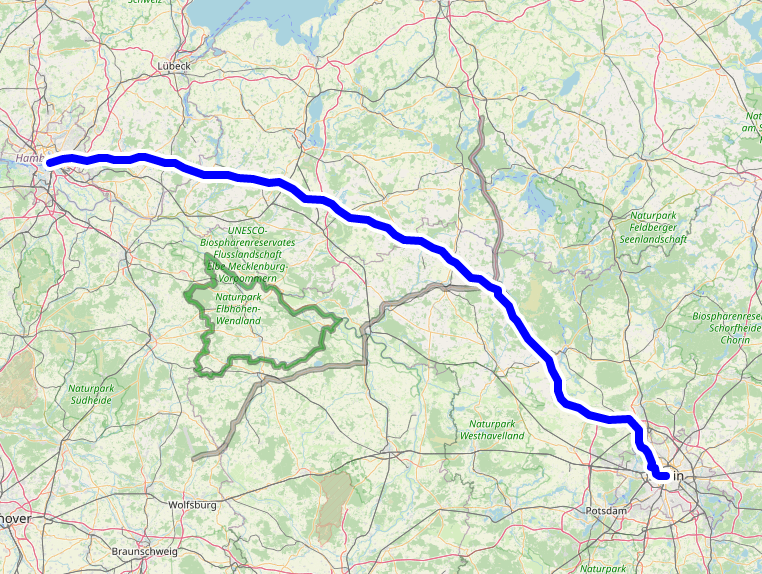

Leaflet.HighlightableLayers
===========================

Leaflet.HighlightableLayers provides a modified version of the vector layers inheriting from
[`L.Path`](https://leafletjs.com/reference-1.7.1.html#path) (for example Polyline, Polygon, etc.) with these additional features:
* Lines can get an outline. For example, a blue line can get a black border to highlight it more. Polygons can get an outline
  for their border.
* Mouse/touch interactions with thin lines get some tolerance. For example, hovering or clicking a line will also work when the
  mouse pointer is a couple of pixels next to the line. This is similar to
  [Leaflet.AlmostOver](https://github.com/makinacorpus/Leaflet.AlmostOver), but the interactions trigger the usual Leaflet events
  on the layer rather than custom ones.
* Individual layers can be raised to make sure they are shown above all others.

The main use case of this layer is maps with multiple vector layers that can be selected/unselected. Together, these features make
the user experience much more enjoyable: The layers are easier to see, easier to click, and when clicked can be highlighted.

Under the hood, Leaflet.HighlightableLayers renders multiple clones of the same vector layer with different styles (stroke width,
colour, ...) on top of each other. For example, in case of a 5px wide blue line, a 10px wide white line with the same coordinates
would be rendered underneath it (for the outline), along with a 20px wide transparent line (for catching mouse/touch interactions).



[Demo](https://unpkg.com/leaflet-highlightable-layers/example.html)\
[Demo on FacilMap](https://facilmap.org/r8pFjVqUdNNP)


Usage
-----

If you are using a module bundler, you can install Leaflet.HighlightableLayers using `npm install -S leaflet-highlightable-layers` and use it in your code like so:

```javascript
import { HighlightablePolyline } from 'leaflet-highlightable-layers';
const line = new HighlightablePolyline(
    [[51.96119, 11.79382], [53.16653, 14.04877]],
    { color: '#ffffff', weight: 3, opacity: 0.35, raised: false }
).addTo(map);

line.on("click", () => {
    // Make the line look selected/unselected on click
    const shouldHighlight = !line.realOptions.raised;
    line.setStyle({ opacity: shouldHighlight ? 1 : 0.35, raised: shouldHighlight });
});
```

TypeScript is supported. Note that when using Leaflet.HighlightableLayers like this, `L.HighlightableLayers` is not available on the global `L` leaflet object.

If you want to use Leaflet.HighlightableLayers in a static HTML page, it is available as `L.HighlightableLayers`:
```html
<script src="https://unpkg.com/leaflet"></script>
<script src="https://unpkg.com/leaflet-highlightable-layers"></script>
<script>
    const line = new L.HighlightableLayers.HighlightablePolyline(...).addTo(map);
</script>
```

The following classes are available:
* `HighlightableCircle`
* `HighlightableCircleMarker`
* `HighlightablePolygon`
* `HighlightablePolyline`
* `HighlightableRectangle`

These are direct sub classes of their Leaflet equivalents, so they can be used in the same way, with the following differences:
* `layer.options` contains a modified version of the options that you have set for the layer. To access the unmodified options,
  use `layer.realOptions`. For modifying the options of an existing layer, never change anything in `layer.options` or `layer.realOptions`
  directly, but rather use `layer.setStyle()`. This will make sure that the layer clones are updated accordingly.

By default, the highlightable layers will create an outline that is twice as big as the line. The outline will be either black or
white, depending on the brightness of the color of the line (white for dark lines, black for bright lines). Lines will have a 20px
wide transparent overlay that catches mouse/touch events.

You can customize highlightable layers using the following options (in addition to the options already provided by their original
counterparts):
* `raised`: If set to `true`, will raise the layer above the others.
* `outlineWeight`: The width of the outline. Note that the outline is just another line underneath the actual line. So if you have
  a 10px wide line and want a 1px border around it, you will have to specify `outlineWeight: 12` so that the outline is 2px wider
  than the line, so it will overlap 1px on each side. By default, the outline will be twice as wide as the line.
* `outlineColor`: The color of the outline. By default, it will be black for bright lines and white for dark lines.
* `generateStyles`: A function that sets the styles for all the layer clones. See below ([Custom styles](#custom-styles)) for more
  info.

**Tip:** Use `{ opacity: 0.35, raised: false }` for unselected layers and `{ opacity: 1, raised: true }` for selected layers.)


### Custom vector layers

If you are using a custom layer that extends `L.Path` and would like to make it highlightable, use the `createHighlightableLayerClass`
method to create a subclass of your custom layer class with all the necessary methods injected. Specify any methods that modify the
geometry of the layer in the second parameter. In case of `L.Circle` for example, that would be `setRadius` and `setLatLng`.

```javascript
const HighlightableCustomVectorLayer = L.HighlightableLayers.createHighlightableLayerClass(L.CustomVectorClass, ['setRadius', 'setLatLng']);

new HighlightableCustomVectorLayer().addTo(map);
```

The same in TypeScript:

```typescript
import { createHighlightableLayerClass } from 'leaflet-highlightable-layers';

const HighlightableCustomVectorLayer = createHighlightableLayerClass<typeof CustomVectorLayer, CustomVectorLayer, CustomVectorLayerOptions>(CustomVectorLayer, ['setRadius', 'setLatLng']);

new HighlightableCustomVectorLayer().addTo(map);
```

What this does:
* Create a subclass of `CustomVectorLayer`.
* In the constructor, copy the options over to `realOptions` and generate the clone layers based on the layer identifiers returned by
  `options.generateStyles()`. Store those layers in `layer.layers`, keyed by layer identifier.
* Override the `onAdd` and `onRemove` methods to also add/remove the clones to/from the map.
* Override the `redraw` methods and the specified methods (in the example `setRadius` and `setLatLng`) to call the same method on all
  the clones.
* Override the `setStyle` method to call the `generateStyles` option and set the generated styles on the layer and its clones.


### Panes

`Leaflet.HighlightableLayers` adds the following panes to the map:
* `lhl-raised`: Used for layers with `raised: true`. Has a `z-index` of 620, so it lies above markers (600), but below tooltips (650)
  and popups (700).
* `lhl-almost-over`: Used for the invisible overlay that catches mouse/touch interactions. Has a `z-index` of 201. This means that it
  lies just above tile layers, but below everything else. This is so that it doesn't steal interactions from other layers. To not steal
  interactions from itself, the line and outline layers have `interaction: false`, so any mouse/touch interactions will go through to
  the interaction layer.


### Custom styles

The `generateStyles` option is used to generate the derived options for each of the layer clones. It receives the options object of
the layer and is expected to return an object that maps layer identifiers to options objects. The `main` layer identifier refers to
the layer itself. For each other layer identifier, a clone of the layer is created and the specified options are applied to it.
The main layer is the only interactive one that will receive mouse events, the clones are non-interactive. Also keep in mind that
the order matters, layers that appear later in the list will be on top of layers earlier in the list (as long as they are rendered
on the same pane).

The second argument passed to the `generateStyles` function is an instance of `L.Renderer`. This instance is created specifically
for the layer (rather than using the pane renderer). This way, the layer and its clones are contained under a separate DOM element
that can be styled separately. Internally, Leaflet.HighlightableLayers applies the opacity to the renderer container rather than
to the individual layer clones, to make sure that the outline doesn't shine through the main line.

In this example, we want to render a polyline with 3 clones to create a 3-striped line. The main line should be transparent and
act as the interaction layer, while the 3 clones have different widths and colors each. Since we are adding all 3 clones to the
same pane, the order of the clones is important (the widest line first).

```javascript
new L.HighlightableLayers.HighlightablePolyline([[52.06262, 12.55737], [51.98995, 14.1394]], {
    generateStyles: (options, renderer) => ({
        main: { opacity: 0, weight: 30, pane: 'lhl-almost-over' },
        line1: { ...options, color: '#0000ff', weight: 30, renderer },
        line2: { ...options, color: '#00ff00', weight: 20, renderer },
        line3: { ...options, color: '#ff0000', weight: 10, renderer }
    })
}).addTo(map);
```